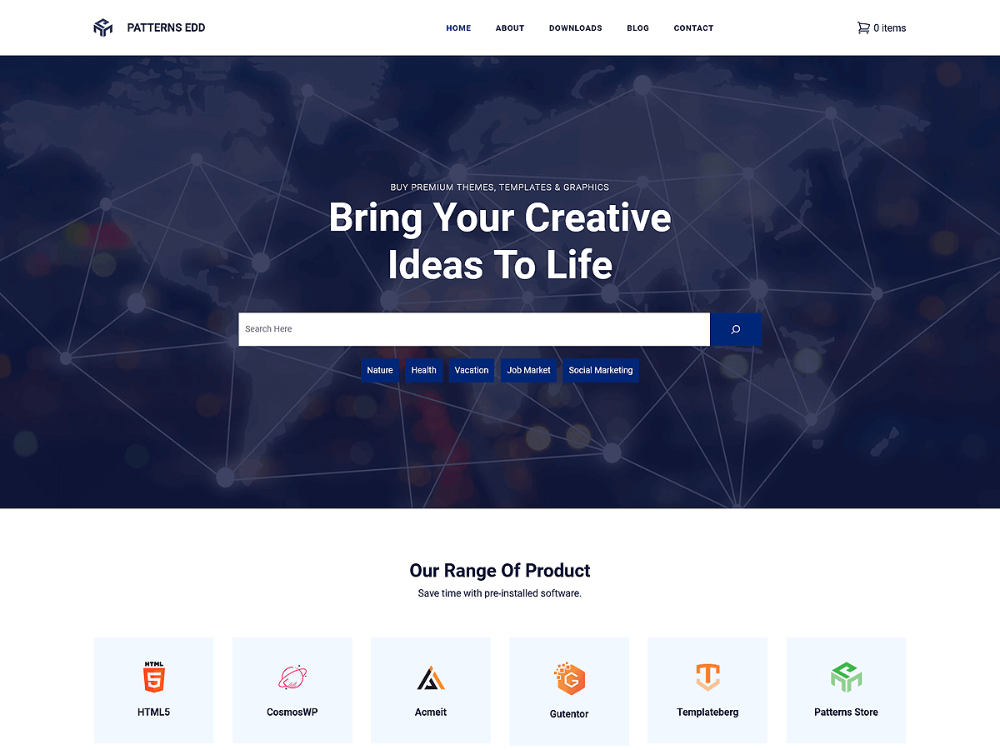

# Patterns Edd

Patterns EDD is a modern and versatile WordPress theme built for digital product stores, download sites, and creators using Easy Digital Downloads. Powered by WordPress Full Site Editing (FSE), this block-based theme enables easy customization of headers, footers, templates, and global styles directly in the Site Editor. It features pre-designed patterns and layouts tailored for showcasing digital products, featured items, pricing tables, testimonials, team members, about pages, download sections, and contact forms. Includes layouts for presenting featured sections, services, about, pricing, product galleries, team, testimonials, contact page, and more. Fully responsive and performance-optimized, Patterns EDD ensures your digital store looks sleek and functions smoothly across all devices—helping you connect effectively with your customers.

Primary color: `#002776`.



## Features

- 3 hero and landing patterns
- 7 card layouts (card-1 through card-7)
- 9 archive/post-listing patterns
- Contact page pattern (page-contact)
- 1 menu navigation pattern
- 1 commerce pattern (cart, checkout, product listings)
- 12 section layout patterns (featured sections and section titles)
- Full Site Editing (FSE) support
- Responsive design
- 83 block patterns + 19 templates + 11 template parts
- Easy Digital Downloads (EDD) integration with checkout flow pages
- EDD checkout flow pages: page confirmation, page order history, page receipt, page transaction failed

## Requirements

- WordPress 6.6 or higher
- PHP 7.0 or higher
- Tested up to WordPress 6.7

## Development

This theme uses `@wordpress/scripts`:

```sh
npm install
npm run start    # dev mode with watch
npm run build    # production build
```

## License

GNU General Public License v2 or later.

This theme is based on [WP Block Theme Boilerplate](https://github.com/codersantosh/wp-block-theme-boilerplate), (C) 2025 Santosh Kunwar, [GPLv2 or later](https://www.gnu.org/licenses/gpl-2.0.html).
